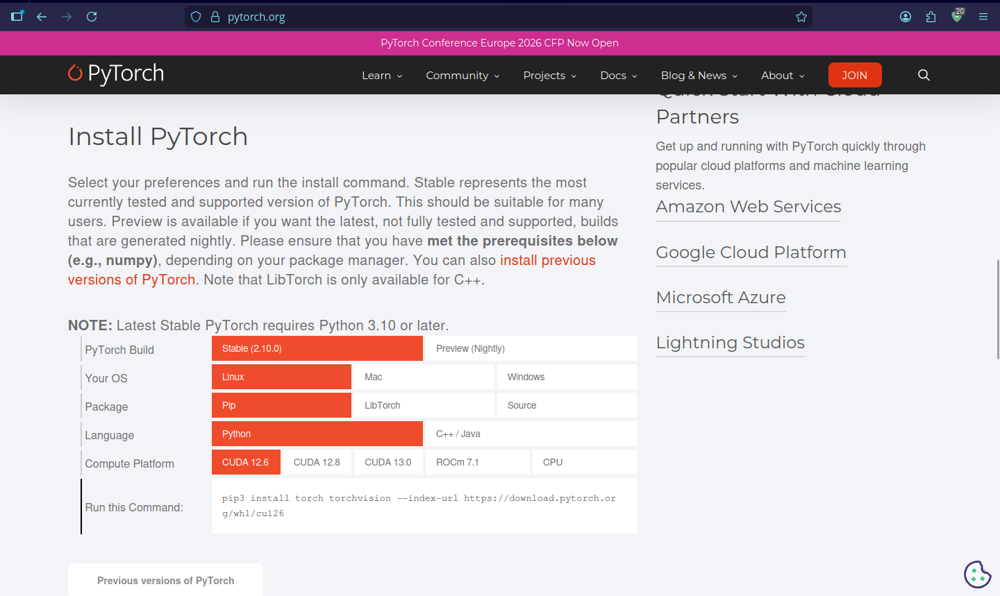

# 📝 About The Project

#### The **Book Recommendation System** is a comprehensive, end-to-end platform designed to help developers and learners navigate the vast world of programming literature. In an era where thousands of technical books are available, finding the right resource can be overwhelming. This system simplifies that journey by providing intelligent, context-aware recommendations tailored to user interests.

## The Problem It Solves
#### Traditional search engines often rely on simple keyword matching, which can miss relevant results. This project goes beyond that by understanding the semantic meaning behind book descriptions. Whether you are looking for deep dives into "Backend Architecture" or beginner-friendly "Data Science" guides, the system recognizes the core topics and suggests the most relevant titles.

## How It Works (The Big Picture)
1. #### `Smart Data Processing`: We take raw data about programming books, `clean` it, and `analyze` it using advanced `data science` tools to ensure only the highest quality information is used.
2. #### `Machine Learning Intelligence`: Using `PyTorch` and modern `embedding techniques`, the system "reads" the books and transforms their content into a mathematical format that allows it to `calculate similarities` between different titles.
3. #### `Fast & Scalable Retrieval`: To ensure you get your results instantly, we use a `Vector Database (PGVector)`, which is specifically designed to handle high-speed searches across large datasets.
4. #### `Modern Web Experience`: The entire engine is wrapped in a high-performance `FastAPI` backend and presented through a sleek, responsive Next.js frontend, making it accessible and easy to use for everyone.
5. #### `Reliable Deployment`: The project is fully containerized using `Docker`, ensuring that it runs smoothly on any machine (Windows, Linux, or macOS) with minimal setup.

## Why This Project?
#### This project isn't just about a model; it’s about a complete ecosystem. It demonstrates the full lifecycle of a machine learning product—from raw data to a functional, containerized web application.

---

# ⚙️ Setup & Installation

### 1. Create Virtual Environment
First, create a virtual environment to keep dependencies isolated:
```bash
python -m venv venv
```

### 2. Activate the Environment
Choose the command based on your Operating System:
- `Linux` / `macOS`:
    ```bash
    source venv/bin/activate
    ```

- `Windows`:
    - `Command Prompt (CMD)`:

        ```bash
        venv\Scripts\activate.bat
        ```

    - `PowerShell`:

        ```bash
        .\venv\Scripts\Activate.ps1
        ```

### Verification:
#### Once activated, you should see the environment's name in parentheses at the start of your terminal prompt, for example: `(venv) C:\Users\YourName\Project>`.

---

# Requirements

#### **python** `3.12.2`
#### **PyTorch** : go to [pytorch](https://pytorch.org/) and choose what you want to install if you have Linux, Windows, or macOS.


**Note:** You will get a command to run in your terminal. 

**If you are on Linux, run this directly:**
```bash
pip3 install torch torchvision --index-url https://download.pytorch.org/whl/cpu
```

---

# Install Dependencies
Once activated, install the required packages:
```bash
pip install -r ml/requirements.txt
```
```bash
pip install -r backend/requirements.txt
```

---

# 📂 Project Structure
#### you can show the [Project Structure](FileStructure.md) here 

---

## 🛠 Tech Stack
- **Language:** `Python 3.12`
- **ML Framework:** `PyTorch`, `scikit-learn`
- **Data Handling:** `Pandas`, `NumPy`
- **Data Cleaning:** `Pandas`, `NumPy`
- **Data Visualization:** `matplotlib`, `seaborn`
- **Data Processing:** `scikit-learn`, `category-encoders`
- **Data Visualization:** `matplotlib`, `seaborn`
- **Embedding:** `sentence-transformers`
- **API:** `FastAPI`
- **FrontEnd:** `React` - `Next`
- **Contenarization:** `Docker`
- **DataBases:** `PostgreSQL`
- **Vector DataBases:** `PGVector`
- **Scripts:** `Shell Script`

---
